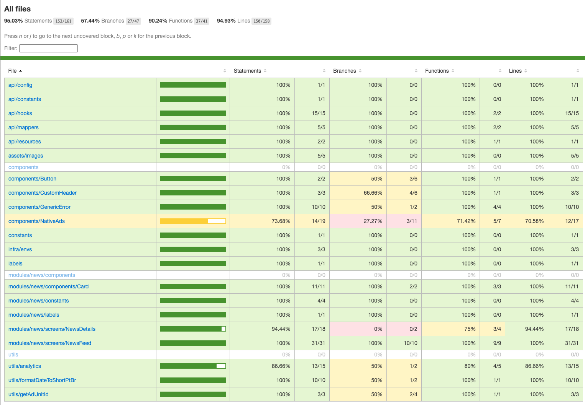

# 📂 Repositório

- 🔗 Link: picpay-news
- 🌍 Visibilidade: Público
- 🌱 Branch padrão: main
- 📜 Licença: Não definida — este projeto não possui licença open source.
- ⚠️ Uso, modificação ou redistribuição do código somente com autorização prévia do autor.

# 🚀 Como rodar o projeto

## 🧰 Pré‑requisitos (ambiente)

- Node: v18.20.8
- Yarn: 1.22.22
- Java/JDK: OpenJDK 17.0.16 (Zulu 17.60+17-CA)
- Android SDK: 35
- Xcode (iOS): 18.5
- Ruby: 2.6.10
- CocoaPods: 1.16.2
- ADB: 1.0.41 (36.0.0-13206524)

# 📦 Instalação

```
// 1 - Instalar dependências
yarn install

// 2 - Instalar dependências iOS
cd ios
pod install
cd ..
```

# ▶️ Execução

## Android

```
// Iniciar Metro (se não abrir automaticamente)
yarn start

// Em outro terminal, instalar e iniciar app Android
yarn android
```

## iOS

```
// Após o pod install, rode pelo Xcode (target correto) ou:
yarn ios
// Dica: se o Metro já estiver rodando, um "Reload" no simulador costuma resolver.
```

# 🛰️ Dicas de Metro/ADB

Se o app Android não detectar o Metro:

```
// Inverter porta do Metro (8081)
adb reverse tcp:8081 tcp:8081

// (Opcional) Se usar outra porta/serviço local, ajuste conforme necessário
// Exemplo comum: Reactotron em 9090
adb -s <nome do device> reverse tcp:9090 tcp:9090

// Listar dispositivos/emuladores conectados
adb devices
```

# 🏷️ Scripts úteis

```
{
  "android": "react-native run-android",
  "ios": "react-native run-ios",
  "lint": "eslint .",
  "start": "react-native start",
  "test": "jest"
}
```

# 🔐 Variáveis de ambiente

Não há variáveis `.env` neste projeto.

# 🧩 Dependências nativas e integrações

- Firebase: arquivos `google-services.json` (Android) e `GoogleService-Info.plist` (iOS) estão versionados no repositório.
- Google Ads: IDs de apps/placements estão no projeto.
- Reactotron: Configurado no projeto para ajudar no processo de desenvolvimento
- Google AdMob: Para controle dos ads

# 🎯 Estratégia de intercalação de Ads

## 📡 Rede/SDK utilizada

Google AdMob (sem mediação — bidding/waterfall desativado).

## ⏱️ Regras de frequência e posicionamento

- NewsFeed: Anúncio nativo exibido a cada 5 cards de notícias.
- NewsDetails: Banner exibido no final da tela de detalhes da notícia.

## ⚙️ Configuração

- Origem dos App IDs: Definidos localmente no arquivo evns na pasta infra.
- Origem dos Ad Unit IDs: Gerenciados no painel do Google AdMob.
- Tipo: Configuração dinâmica — as unidades de anúncios são atribuídas e controladas no painel AdMob.
- Fallback: Caso falhe o carregamento do anúncio, uma exceção é registrada no Firebase Analyticss.

## 🔒 Consentimento

Exibição apenas para fins de teste — sem configuração de controle de idade ou fluxo de aceite (GDPR/CCPA).

# 📊 Como os eventos são emitidos

## 🛠️ Ferramenta

Firebase Analytics (sem mediação/consent flow integrado).

## 🎯 Eventos de Ads

- `ad_loaded`
- `ad_failed`
- `ad_clicked`

## 🔧 Parâmetros

Atualmente não enviamos parâmetros; a implementação é flexível para adicionar (ex.: placement, format, network, latency_ms, ad_unit_id) quando necessário.

## 🧭 Eventos de produto/tela

- `screen_view`
- `exception`
- `select_content`
- `success`

➕ A base permite incluir novos eventos conforme necessidade do produto.

## 📁 Estrutura de tracking

- Arquivo principal: `src/ultis/analytics/FirebaseAnalytics.js`
- Convenção de nomes: snake_case

# 🔒 Consentimento

Sem integração atual com GDPR/CCPA (sem coleta de consentimento no app).

# 🏗️ Decisões de arquitetura

## 🗂 Organização por feature + separação de responsabilidades

- Padrão por feature (ex.: modules/news) com divisão interna por UI, lógica (hooks) e estilos.
- Camadas principais:

```
src/
 ├── api/          # Configurações e integração com APIs externas
 ├── assets/       # Recursos estáticos (imagens, cores, fontes)
 ├── components/   # Componentes globais reutilizáveis
 ├── constants/    # Constantes globais do projeto
 ├── infra/evns/   # Configurações e variáveis do app (IDs, chaves)
 ├── labels/       # Textos e labels globais
 ├── modules/      # Módulos por feature/domínio
 ├── routes/       # Configuração e pilhas de navegação
 └── utils/        # Funções utilitárias e helpers
```

# 🧩 Padrão interno por arquivo

- UI: \*.index.ts(x) — layout e composição da tela/componente
- Lógica: use\*.ts — hooks (estado, efeitos, regras)
- Estilos: \*.styles.ts — styled-components e/ou StyleSheet
- Testes: \*.spec.ts(x) e, quando aplicável, **snapshots**/

**Observação:**
O projeto utiliza componentes de função e de classe para demonstrar conhecimentos técnicos.
Também possui estilos combinados de styled-components e StyleSheet com a mesma finalidade de demonstrar conhecimento ténicos.

Em um ambiente de produção real, normalmente se adota um padrão único para cada caso (componentes e estilos), visando consistência e manutenção a longo prazo.

## 🎯 Por que esse padrão?

- Manutenção e expansividade: separar UI/Regra/Estilo reduz acoplamento e facilita refatorações.
- Escalável: adicionar novas features não “polui” camadas globais — cada módulo cresce no próprio escopo.

## 🧪 Testes

- Foco em testes integrados com `@testing-library/react-native` (garantem fluxo/tela de ponta a ponta).
- Snapshots em todas as telas (evita regressões visuais).
- Unitários onde faz sentido (utils, funções puras).
- Cobertura alta geral; pontos a evoluir: components/NativeAds, NewsDetails (branches), alguns utils (branches).



# 🧯 Problemas (iOS • RN 0.80+ • NativeAds)

**Resumo:** há uma incompatibilidade do `react-native-google-mobile-ads` com o React Native 0.80+ (Fabric), afetando Native Ads no iOS.
**Sintomas:** erros como “View config not found” ou “Property does not exist” decorrentes de props nativas (ex.: responseId via RCT_EXPORT_VIEW_PROPERTY) que não se alinham ao novo sistema de renderização.
**Impacto:** bloqueia build/execução de Native Ads no iOS. Android segue funcionando normalmente.
**Caminhos:**

- ⬇️ Downgrade do RN para 0.76.0 (compatível com a lib atual).
- ⏳ Aguardar atualização da lib com suporte a Fabric (issue pública: [#777](https://github.com/invertase/react-native-google-mobile-ads/issues/777)).

**Status report:** problema identificado no dia 10; não houve tempo hábil para efetuar downgrade ou troca de biblioteca antes do corte.
